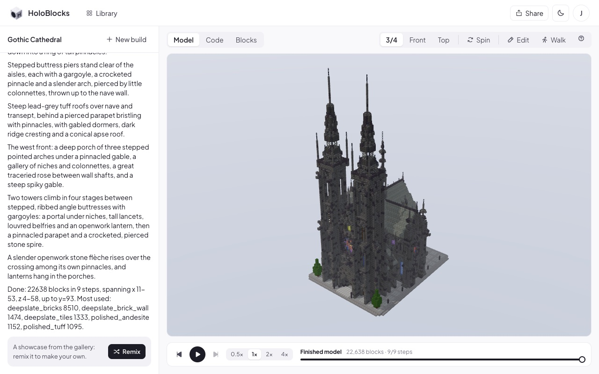
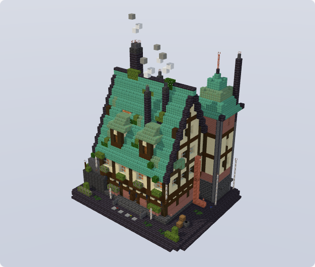
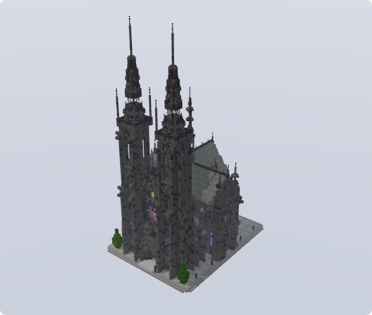
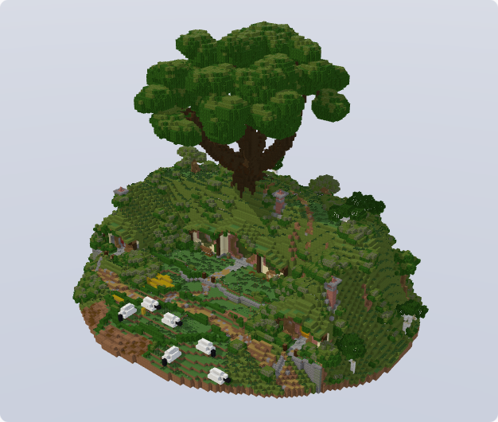
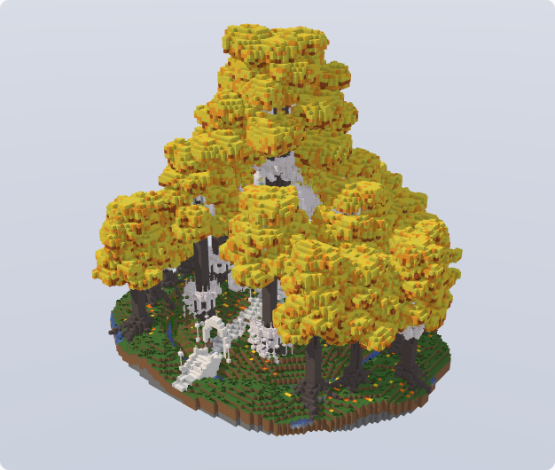

<h1 align="center">
  
  HoloBlocks
</h1>

<p align="center"><b>Describe a structure. Holo builds it, block by block.</b><br />Minecraft builds in code, live in 3D. The block twin of <a href="https://github.com/hcompai/brickyard">HoloBricks</a>.</p>



<table align="center">
  <tr>
    <td align="center"><br />Steampunk manor · 64²</td>
    <td align="center"><br />Gothic cathedral · 64²</td>
    <td align="center"><br />Bag End · 128²</td>
    <td align="center"><br />Caras Galadhon · 112²</td>
  </tr>
</table>

## What you can do

| | |
| --- | --- |
| **Describe** | Type an idea or drop a photo. Holo builds it live in 3D. |
| **Trust** | Every block comes from a ~750-block palette, on a 128×128 site. |
| **Replay** | Scrub the steps, read each step's code, or share a GIF. |
| **Tweak** | Move, replace and place blocks, or walk through the build. |
| **Take it to Minecraft** | Download a WorldEdit `.schem`. |
| **Share** | Publish to the H library. Teammates open it read only and remix. |

## How it works

```
 you ── idea ──▶  Holo  (H Agents API)  ── blocks run ──▶  Workstation
  ▲                 │                                         │
  └── 3D model ◀────┴─────────────── model.json.gz ◀──────────┘
```

Your browser renders every revision and shows it to Holo, so keep the tab open while it builds.

## Run it

Live at [blocks.hcompany.ai](https://blocks.hcompany.ai): sign in with your `@hcompany.ai` account. Setup, deploy, tests and the toolkit are in [docs/README.md](docs/README.md).
