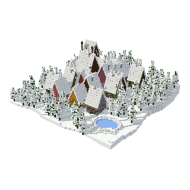
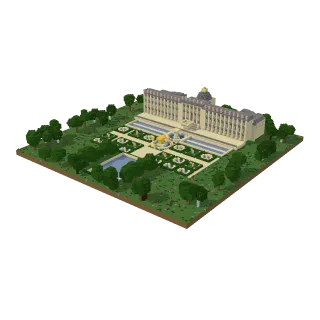
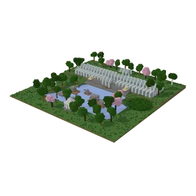
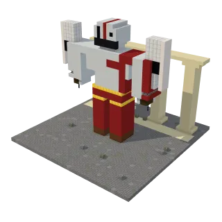

<h1 align="center">
  
  HoloBlocks
</h1>

<p align="center"><b>Tell Holo what you'd like to build, watch it rise block by block, then walk through it or export it.</b><br />The block twin of <a href="https://github.com/hcompai/holobricks">HoloBricks</a>.</p>


<table align="center">
  <tr>
    <td align="center"><a href="https://blocks.hcompany.ai/?public=d1865df6-e627-49cf-9307-09b440b0cd71"></a><br />Hogsmeade Under the Snow</td>
    <td align="center"><a href="https://blocks.hcompany.ai/?public=364d86b5-43fd-4f74-988d-92d29c6879ee"></a><br />The Sun King's Garden</td>
    <td align="center"><a href="https://blocks.hcompany.ai/?public=0fa0b70e-bdab-4a31-a1f4-93b953b3f99e"></a><br />Crystal Palace Park</td>
    <td align="center"><a href="https://blocks.hcompany.ai/?public=ef5dc727-9024-4bb1-940c-d47fdeb65b3e"></a><br />Kratos</td>
  </tr>
</table>

## What you can do

|              |                                                                                   |
| ------------ | --------------------------------------------------------------------------------- |
| **Describe** | Type an idea or drop in a photo, and Holo builds it in 3D while you watch.        |
| **Trust**    | Every block comes from a ~750-block palette, on a 128×128 site.                   |
| **Replay**   | Scrub back through the steps, read each step's code, or share the build as a GIF. |
| **Tweak**    | Move, replace and place blocks, or walk through the build.                        |
| **Export**   | Download a WorldEdit `.schem` and paste it into your world.                       |
| **Share**    | Publish a build so anyone can open it, and fork it into their own once signed in. |

## How it works

```
 you ── idea ──▶  Holo  (H Agents API)  ── blocks run ──▶  Workstation
  ▲                 │                                         │
  └── 3D model ◀────┴─────────────── model.json.gz ◀──────────┘
```

Your browser renders every revision and shows it to Holo, so keep the tab open while it builds.

Every build above was made by Holo from a sentence. Live at [blocks.hcompany.ai](https://blocks.hcompany.ai): browse the public builds without an account, sign in with Google or an email to build.

## Run it yourself

You need Node 20+, [uv](https://docs.astral.sh/uv/) and an H account from
[platform.hcompany.ai](https://platform.hcompany.ai): signing in mints the Agents API key Holo builds with.

```bash
git clone https://github.com/hcompai/holoblocks && cd holoblocks
cd server && uv sync && cd ..
server/.venv/bin/python scripts/pack-toolkit.py               # the toolkit Holo installs on its Workstation
server/.venv/bin/blockyard-gallery web/public                 # the showcases
cd web && npm install
echo "BLOCKYARD_SECRET=$(openssl rand -hex 32)" > .env.local  # signs the sign-in pass
npm run dev
```

Open [http://127.0.0.1:5173](http://127.0.0.1:5173) (not `localhost`) and sign in. Publishing needs
`BLOB_READ_WRITE_TOKEN` from a public [Vercel Blob](https://vercel.com/docs/vercel-blob) store; private builds, forks
and renames need `BLOCKYARD_PRIVATE_BLOB_READ_WRITE_TOKEN` from a separate private one. To try the `blocks` CLI by
hand, `sh setup.sh <build dir>` puts it on your PATH (it may ask for sudo) and links the showcases into that folder.
