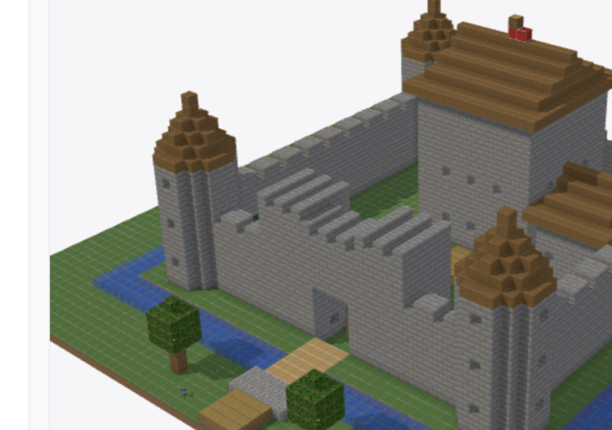
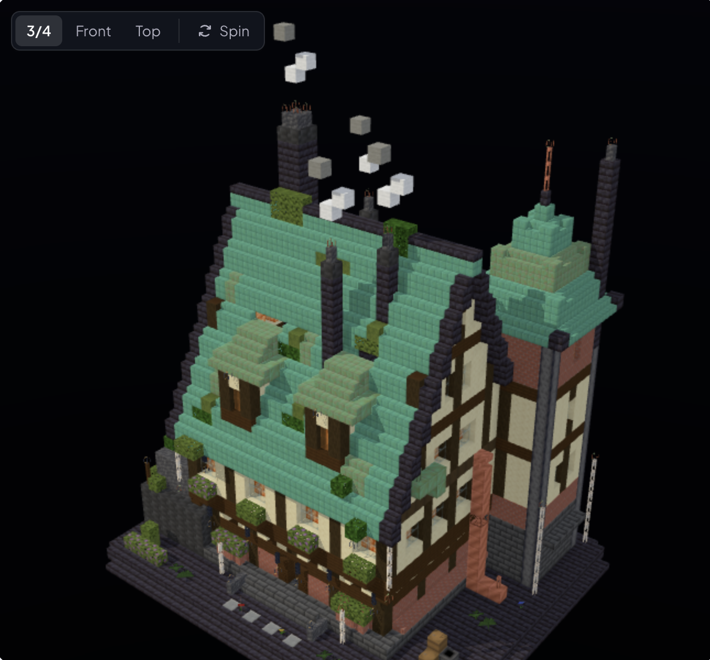
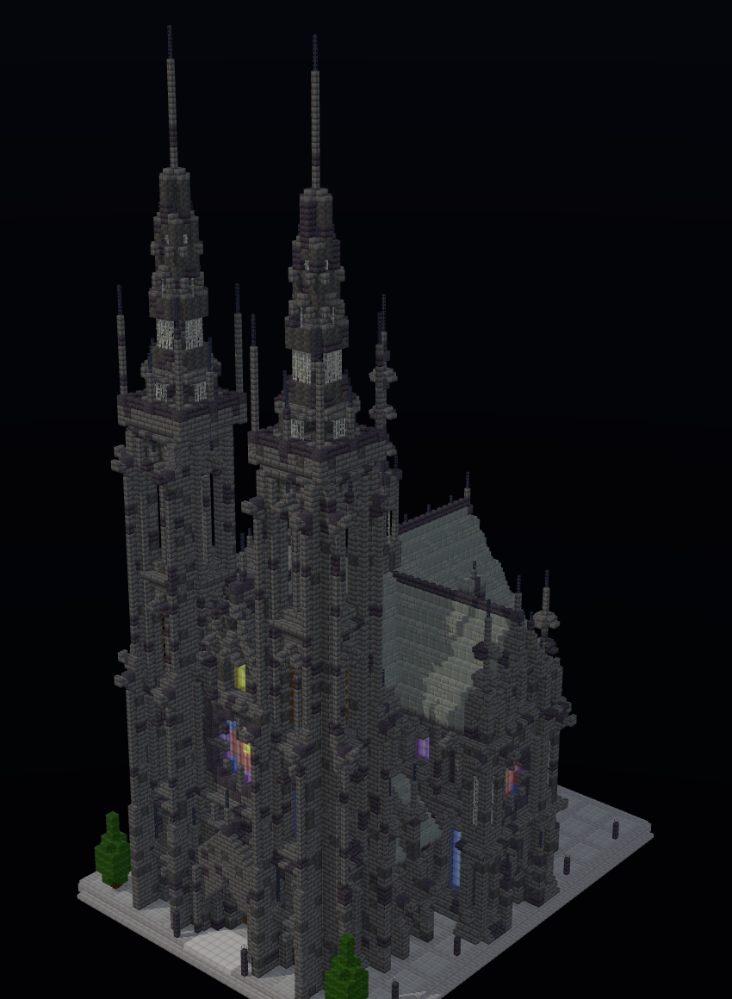

# Blockyard

Watch an agent design Minecraft structures in code, step by step, in the browser. The Minecraft twin of
[Brickyard](https://github.com/hcompai/brickyard).





Each step is a small JavaScript program (`fill`, `set`, `clear`) the builder writes; the site is re-meshed in the
browser after every step, the agent asks the open viewer for renders with `look`, and the finished build downloads
as a WorldEdit `.schem`.

```
web (Vite + React + three.js)                            server (FastAPI + Node sandbox)
┌ header: name · blocks · steps · Download .schem ┐      ┌ Build = boxes per step (+ the step's code) + chat
│ Chat | Library  │ Model | Code | Blocks         │◀─SSE─┤ Session streams steps, undo, messages, renders
│                 │ voxel mesher, Faithful atlas  │      │ Workbench: runs a step's JS in node:vm -> boxes
│                 │ timeline ▶ 1× 2× 4×           │─PUT─▶│ /renders/<id>  (look answered by the open tab)
└─────────────────┴───────────────────────────────┘      └ /download.schem (Sponge v2, WorldEdit/FAWE)
```

## Run

```bash
cd server && uv sync && cd ..
cd web && npm install && npm run build && cd ..
server/.venv/bin/blockyard                          # http://127.0.0.1:8000
```

Needs Node 20+ (the step sandbox and the web build). Frontend hot reload: `cd web && npm run dev`
(http://127.0.0.1:5173, proxies `/api` to the server).

Holo needs a key: `HOLO_API_KEY=... server/.venv/bin/blockyard` (`HAI_API_KEY` also works). Optional: `HOLO_MODEL`,
`HOLO_BASE_URL`, `BLOCKYARD_PORT`, `BLOCKYARD_DATA`.

## How a build works

A build is a 64x64x64 site with a grass floor at y=0. Builders add steps through a `Workbench`; a step is JavaScript
run in a `node:vm` sandbox with a 3 s budget:

```js
fill(8, 1, 8, 55, 6, 55, "stone_bricks", "walls");        // modes: solid (default), hollow, walls
for (let i = 8; i <= 55; i += 2) set(i, 7, 8, "stone_bricks");
set(31, 1, 56, "oak_door[facing=south]");                 // doors place both halves
fill(24, 13, 24, 39, 13, 39, "spruce_stairs[facing=north]");
```

The sandbox only collects boxes; the server validates block ids and states against `blocks.json`, clips to the site
and stores the boxes with the step. Later boxes overwrite earlier ones, so the viewer (and the `.schem`) resolve a
build by replaying steps in order, and scrubbing the timeline is just replaying fewer of them. Undoing a step drops
its boxes.

| Builder | What it does |
| --- | --- |
| `holo` | Holo (`holo4-27b`) in a tool loop: `build` (a titled JS step), `undo_step`, `look` (4-view render from the open viewer), `find_blocks`, `find_reference` (Wikipedia photos), `set_name`. Reasoning streams live into the chat. |
| showcases | Scripted builds (`server/blockyard/builders/showcases/`): an overgrown steampunk manor and a gothic cathedral. No model needed; it seeds the library. |

## Blocks and rendering

`server/blockyard/blocks.json` is the palette (~400 blocks): textures per face, shape (`cube`, `stairs`, `slab`,
`log`, `fence`, `wall`, `pane`, `cross`, `torch`, `lantern`, `carpet`, `door`), tints and transparency. The web fetches
it, composes a texture atlas from `web/public/textures`, and meshes the site with face culling and ambient occlusion.
Fences, walls and panes connect to their neighbours; stairs, slabs, logs and doors read their block state.

Regenerate the palette and texture sheet from a Faithful 32x pack with `uv run scripts/palette.py <pack>/assets/minecraft/textures/block`.
Textures are from [Faithful](https://faithfulpack.net/) (see `web/public/textures/LICENSE.txt`).

## Tests

```bash
cd server && uv run pytest -q && uv run ruff check .
cd web && npm run typecheck
```
