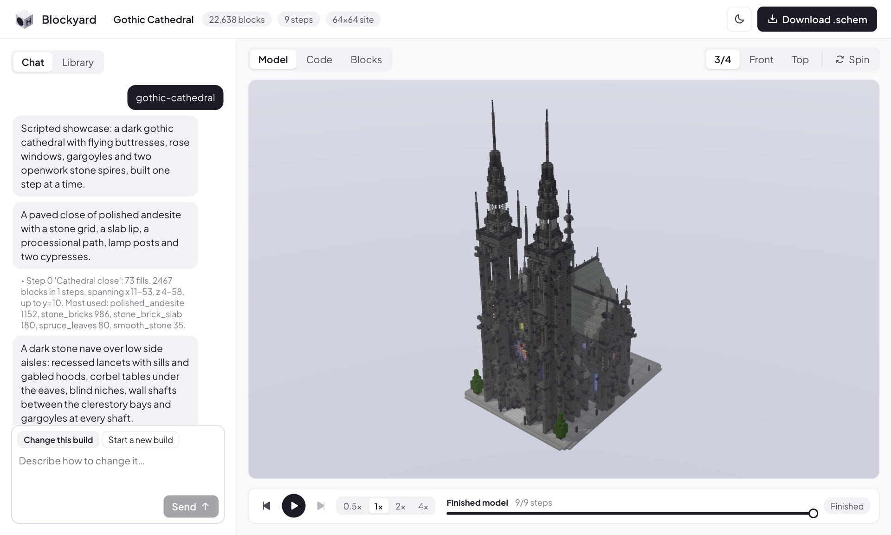

<h1 align="center">
  
  Blockyard
</h1>

<p align="center">Watch Holo build Minecraft models in code, step by step.<br />The Minecraft twin of <a href="https://github.com/hcompai/brickyard">Brickyard</a>.</p>



- **Chat** to describe a build; Holo, a sagent agent, writes a Python build script, and every run rebuilds the model, streams the new steps and shows Holo the render.
- **Every block is checked** against a ~750-block palette and clipped to the 128x128 site, 100 blocks tall.
- **Replay** the steps, read each step's code, browse the blocks, download a WorldEdit `.schem`.

Gallery for the H team: [blockyard-h-company.vercel.app](https://blockyard-h-company.vercel.app) (Vercel login).

## Run

```bash
cd server && uv sync && .venv/bin/playwright install chromium-headless-shell && cd ..
cd web && npm install && npm run build && cd ..
server/.venv/bin/blockyard                    # http://127.0.0.1:8000
```

Needs Node 20+. Hot reload: `cd web && npm run dev` (http://127.0.0.1:5173).

| Variable | Default |
| --- | --- |
| `HAI_ROOT` | unset: only the scripted showcases can build |
| `HAI_API_KEY`, `HAI_BASE_URL` | for Holo: your key, and `https://api.hcompany.ai/v1/models` |
| `LINKUP_API_KEY` | for Holo's image search |
| `HOLO_MODEL` | `holo4-27b` |
| `BLOCKYARD_PORT` | `8000`, on 127.0.0.1 only (no auth) |
| `BLOCKYARD_DATA` | `./data` |

## Holo, for now

Live building runs on your machine only. The Vercel site is a read-only gallery of finished builds.

```
browser tabs <── steps, renders ──>  blockyard server  ── starts ──>  sagent (hai venv), agent/holo.py
(yours + a hidden one)                (FastAPI, :8000)                  │ edits build.py in data/workspaces/<build>
                                            ▲                           │ shell: blocks run / look
                                            └────── HTTP tools API ─────┘
```

- Holo is a sagent Forest agent with the managed sandbox tools (`shell`, `write_file`, `search_replace`, ...). It writes `build.py` in plain Python: `step`, `fill`, `set`, `clear` to place blocks, WorldEdit-style patterns (`"70%stone_bricks,30%andesite"`) anywhere a block goes, and `get`, `replace`, `overlay` to read and rework what is placed, with its own functions for roofs, towers, trees and land; `random` is seeded per step, so every run builds the same model. It runs `blocks run`, which rebuilds the model on the server from the first changed step and prints the problems by line, and notes any blocks that float. `blocks look` renders the four views or one view from any angle and zoom. For references it has `web_search` (Linkup pages, then image URLs) and `view_image`: it downloads the photos it wants into the workspace and looks at them, all through the build. Renders reach Holo through `@@attach PATH` lines, which the shell tool swaps for the image in the same result.
- Renders come from a hidden Chromium tab the server keeps on each build asking for them, so Holo sees its model with no tab open; without that browser, an open viewer on the build answers instead.
- sagent comes from a local hai checkout recent enough for Linkup's `include_images`: set `HAI_ROOT` to it, with its venv synced (`cd hai && uv sync`).

```bash
export HAI_ROOT=~/code/hai HAI_BASE_URL=https://api.hcompany.ai/v1/models
export HAI_API_KEY=$(grep '^HAI_API_KEY=' $HAI_ROOT/.env | cut -d= -f2- | tr -d '"')
export LINKUP_API_KEY=$(grep '^LINKUP_API_KEY=' $HAI_ROOT/.env | cut -d= -f2- | tr -d '"')
server/.venv/bin/blockyard
```

| To change | Edit |
| --- | --- |
| model, reasoning effort, step and time budget, tools | `agent/holo.yaml` |
| how Holo builds: principles, workflow, build script API, when to stop | `agent/holo.j2` |
| what the build script can call | `server/blockyard/script.py` |

Each request leaves `data/workspaces/<build>/runs/<time>.log` (what Holo did, as the terminal shows it) and `<time>.jsonl` (the full trajectory, reasoning included). The next request on the build replays these trajectories, so Holo continues the conversation. Try the tools by hand from a workspace: `BLOCKYARD_BUILD=<build> ../../../server/.venv/bin/blocks run`.

## Showcases and gallery

The steampunk manor, the gothic cathedral and Bag End are build scripts in `server/blockyard/builders/showcases`, on
the same calls as Holo's, each step told by the comment above it. Holo gets a copy of each, with their renders, to
learn from. To replay one, pick it in the builder menu under a new chat and send any prompt.

```bash
scripts/deploy-gallery.sh --preview           # or --prod; ships the latest run of each showcase, then data/gallery.txt
```

To ship a Holo build, add its id to `data/gallery.txt` (one per line). The gallery shows each build with its chat,
read-only. Open each build once in the app to refresh its thumbnail before deploying.

## Blocks

Textures are from [Faithful](https://faithfulpack.net/) (see `web/public/textures/LICENSE.txt`). Regenerate the
palette and texture sheet from a Faithful 32x pack and the matching vanilla client jar (for block models) with
`uv run scripts/palette.py <pack>/assets/minecraft/textures/block <jar>/assets/minecraft`.

## Tests

```bash
cd server && uv run pytest -q && uv run ruff check .
cd web && npm run typecheck
```
